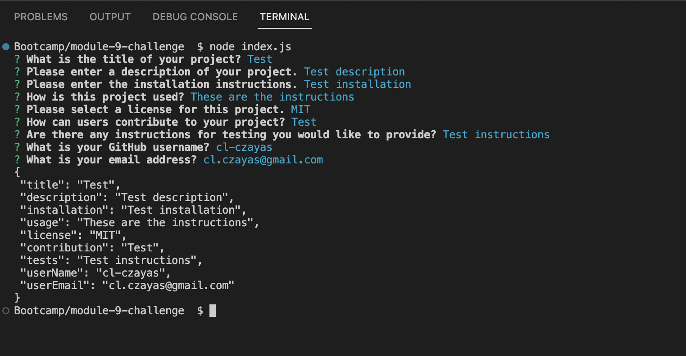
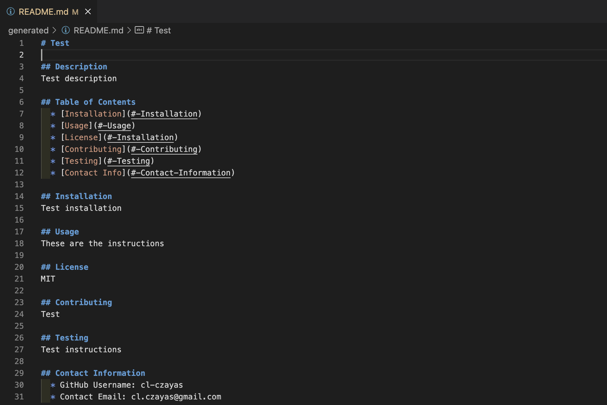

# Node.js Challenge: Professional README Generator

## Access

After opening the terminal in the application's location, the user runs 'node index.js'.

## Description

This application was created in order to generate a complete README in accordance to user input regarding their project.

## Usage

After accessing the application, users answer questions about their project. Once finished, the application generates a completed README markdown file in the 'generated' folder.

## Screenshot

## Credits

Christopher L. Cristóbal Zayas (cl-czayas).